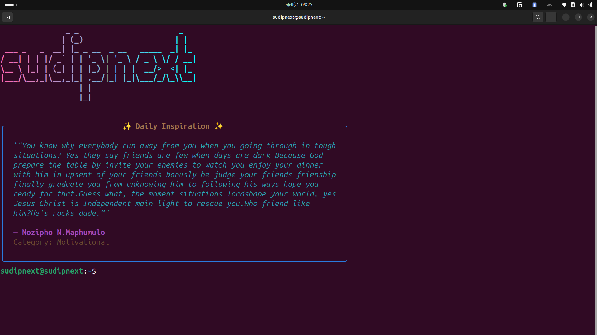

# 🎨 ASCII Art Generator with Inspirational Quotes

A beautiful Python application that generates colorful ASCII art from text and displays random inspirational quotes. Perfect for terminal enthusiasts, motivational displays, or just adding some fun to your command line!

  

## ✨ Features

- 🎨 **Beautiful ASCII Art**: Convert any text to stunning ASCII art with gradient colors
- 📚 **Inspirational Quotes**: Display random motivational quotes from a curated database
- 🌈 **Rich Formatting**: Beautiful terminal output with colors, panels, and styling
- 🔄 **Multiple Modes**: Database-connected or offline mode with JSON quotes
- 🎯 **Customizable**: Choose different fonts and color schemes
- 📦 **Easy Setup**: Simple installation and usage

## 🚀 Quick Start

### Prerequisites

- Python 3.7 or higher
- pip (Python package installer)

### Installation

1. **Clone the repository**
   ```bash
   git clone https://github.com/sudipnext/ascii-art-generator.git
   cd ascii-art-generator
   ```

2. **Create a virtual environment** (recommended)
   ```bash
   python -m venv env
   source env/bin/activate  # On Windows: env\Scripts\activate
   ```

3. **Install dependencies**
   ```bash
   pip install -r requirements.txt
   ```

## 🎯 Usage
You can integrate the Python script into your terminal configuration for quick access. Update your `.bashrc` or `.zshrc` file to run the script automatically or create an alias for easier usage.


### Offline Mode (Recommended for most users)

Use the pre-generated quotes database without needing database connectivity:

```bash
# Basic usage with default name
python main_offline.py

# Custom name
python main_offline.py "Your Name"

# Custom name and font
python main_offline.py "Hello World" "block"
```

### Database Mode

If you have database credentials, you can use the live database connection:

1. **Set up environment variables**
   Create a `.env` file:
   ```env
   DB_USER=your_db_user
   DB_PASSWORD=your_db_password
   DB_HOST=your_db_host
   DB_NAME=your_db_name
   DB_SSLMODE=require
   ```

2. **Run with database connection**
   ```bash
   python main.py
   ```

## 📖 Examples

### Example 1: Run Automatically on Terminal Startup
Add the following line to your `.bashrc` or `.zshrc` file:
```bash
python /path/to/ascii-art-generator/main_offline.py "Welcome to your terminal!" "block"
```
This will display ASCII art with a custom message every time you open a new terminal window or tab.

### Example 2: Create an Alias for Quick Access
Add an alias to your `.bashrc` or `.zshrc` file:
```bash
alias asciiart='python /path/to/ascii-art-generator/main_offline.py'
```
Reload your terminal configuration:
```bash
source ~/.bashrc  # For bash
source ~/.zshrc   # For zsh
```
Now, you can run the script with:
```bash
asciiart "Hello World" "slant"
```

### Example 3: Customize Fonts and Messages
Use the alias with different fonts and messages:
```bash
asciiart "Stay Motivated!" "doom"
asciiart "Code Like a Pro" "digital"
```

### Example 4: Automatically Run on Terminal Startup
To display ASCII art and a motivational quote every time you open a terminal, add the following line to your `.bashrc` or `.zshrc` file:
```bash
python /path/to/ascii-art-generator/main_offline.py "Welcome Back!" "big"
```
This ensures the script runs automatically whenever a new terminal session starts.

These examples make it easy to display ASCII art and inspirational quotes directly from your terminal.

## 🎨 Available Fonts

Try different ASCII art fonts by passing them as the second argument:

- `big` (default)
- `block`
- `3-d`
- `banner`
- `digital`
- `doom`
- `gothic`
- `isometric1`
- `letters`
- `slant`

Example:
```bash
python main_offline.py "AWESOME" "block"
```

## 📁 Project Structure

```
ascii-art-generator/
├── main.py                 # Database-connected version
├── main_offline.py         # Offline version (recommended)
├── quotes_dump.json        # Pre-generated quotes database
├── requirements.txt        # Python dependencies
├── .env                    # Environment variables (create this)
├── README.md              # This file
└── env/                   # Virtual environment (created during setup)
```

## 🛠️ Dependencies

- **pyfiglet**: ASCII art text generation
- **rich**: Beautiful terminal formatting and colors
- **psycopg2-binary**: PostgreSQL database connectivity (for database mode)
- **python-dotenv**: Environment variable management

## 📊 Quotes Database

The included `quotes_dump.json` contains:
- **11,958+ inspirational quotes**
- Multiple categories (motivational, life, success, happiness, etc.)
- Famous authors and thought leaders
- Regularly updated content

### Quote Categories Include:
- Motivational
- Life
- Success
- Happiness
- Wisdom
- Leadership
- Innovation
- And many more!

## 🎨 Customization

### Color Schemes

You can modify the gradient colors in the code:

```python
# Default: Pink to Cyan gradient
start_color = (255, 105, 180)  # Hot Pink
end_color = (0, 255, 255)      # Cyan

# Other color combinations to try:
# Purple to Blue: (138, 43, 226) to (0, 191, 255)
# Orange to Red: (255, 165, 0) to (255, 69, 0)
# Green to Blue: (0, 255, 127) to (0, 191, 255)
```

### Adding Your Own Quotes

To add custom quotes to the offline version:

1. Edit `quotes_dump.json`
2. Follow the existing format:
   ```json
   {
     "id": 99999,
     "category": "custom",
     "quote": "Your inspiring quote here",
     "author": "Your Name",
     "created_at": "2025-01-01T00:00:00"
   }
   ```

## 🤝 Contributing

We welcome contributions! Here's how you can help:

1. **Fork the repository**
2. **Create a feature branch**: `git checkout -b feature/amazing-feature`
3. **Commit your changes**: `git commit -m 'Add amazing feature'`
4. **Push to the branch**: `git push origin feature/amazing-feature`
5. **Open a Pull Request**

### Contribution Ideas:
- 🎨 New color schemes
- 📚 Additional quote categories
- 🔧 Performance improvements
- 📖 Documentation enhancements
- 🐛 Bug fixes
- ✨ New features

## 📝 License

This project is licensed under the MIT License - see the [LICENSE](LICENSE) file for details.

## 🙏 Acknowledgments

- **pyfiglet** developers for ASCII art generation
- **Rich** library for beautiful terminal output
- Quote contributors and authors for inspiration
- Open source community for tools and libraries

## 🐛 Troubleshooting

### Common Issues:

1. **"Module not found" errors**
   ```bash
   pip install -r requirements.txt
   ```

2. **Database connection issues**
   - Use offline mode: `python main_offline.py`
   - Check your `.env` file configuration

3. **Font not found**
   - Use one of the supported fonts listed above
   - Check pyfiglet documentation for more fonts

4. **Colors not displaying**
   - Ensure your terminal supports colors
   - Try: `export FORCE_COLOR=1`

## 📧 Support

- 🐛 **Bug reports**: [Open an issue](https://github.com/sudipnext/ascii-art-generator/issues)
- 💡 **Feature requests**: [Start a discussion](https://github.com/sudipnext/ascii-art-generator/discussions)
- ❓ **Questions**: Check existing issues or start a new discussion

---

**Made with ❤️ by [sudipnext](https://github.com/sudipnext)**

⭐ Star this repo if you found it helpful!
